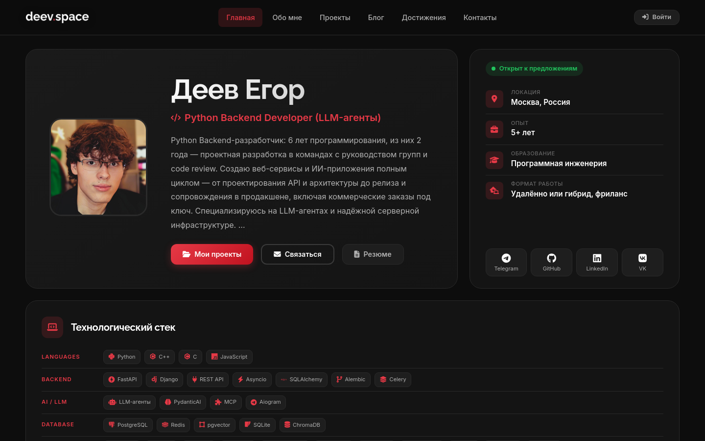
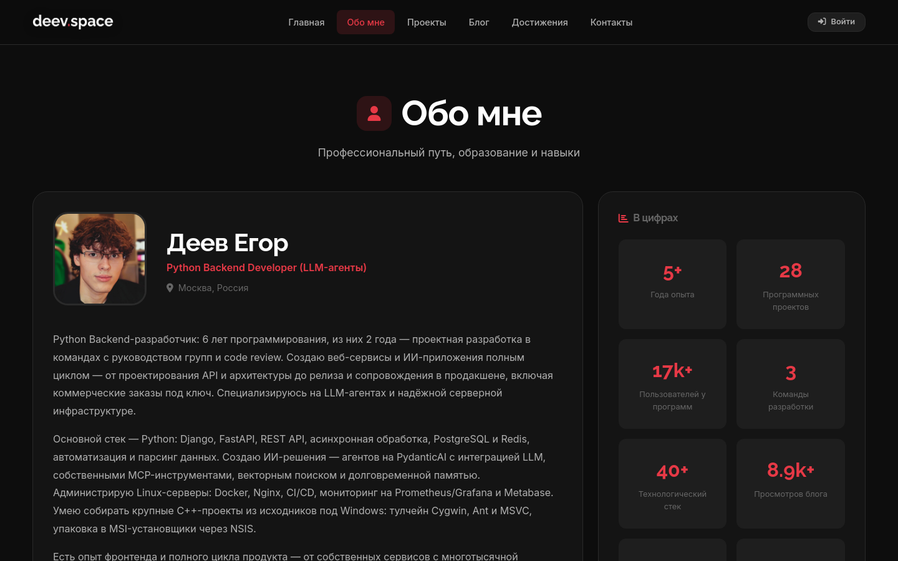
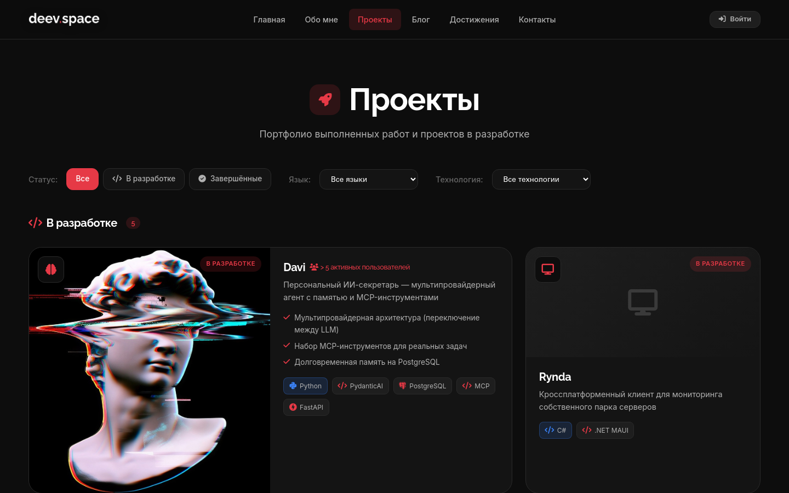
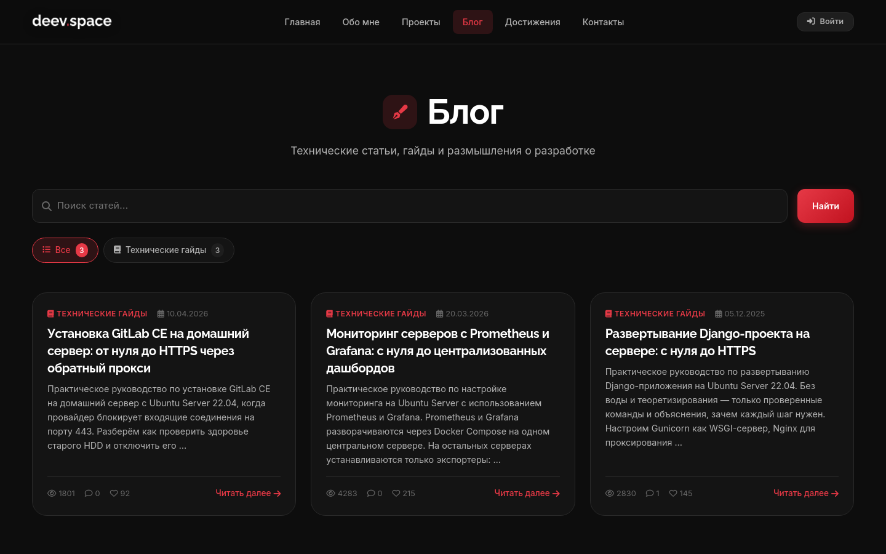
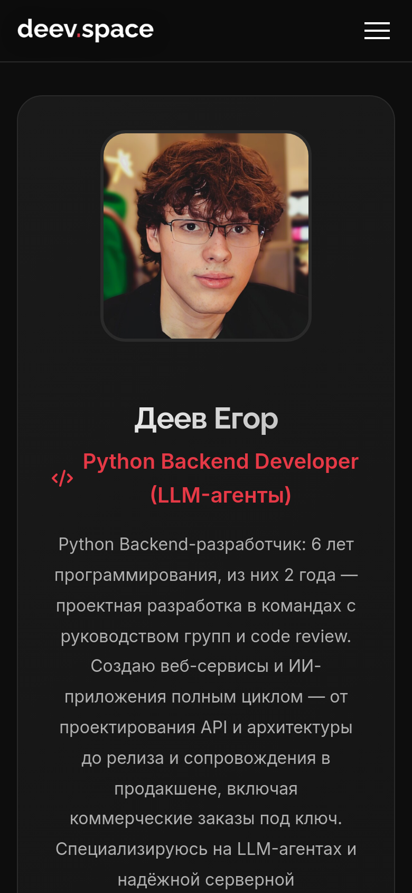
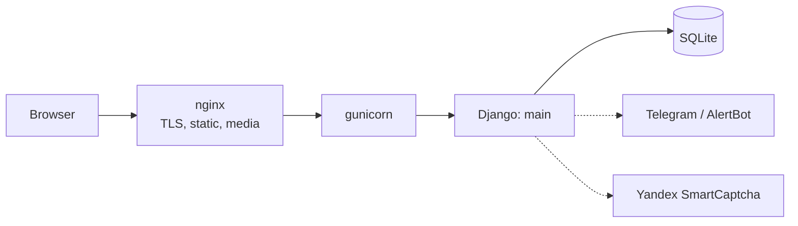

# deev.space

[Русский](README.md) · **English**

[](https://github.com/EDeev/deev.space/actions/workflows/ci.yml)
[](https://github.com/EDeev/deev.space/actions/workflows/docker.yml)
[](https://github.com/EDeev/deev.space/releases)
[](LICENSE)

Personal portfolio website of a Python developer: projects, blog, experience and tech stack, article
ratings without sign-up. Source code of [deev.space](https://deev.space).

**Status:** personal project, actively developed · live at [deev.space](https://deev.space)



**Stack:** Python 3.12 · Django 4.2 · SQLite · bleach · Yandex SmartCaptcha · gunicorn + nginx · Docker

## Features

- Home page with a profile card, tech stack by category and a "by the numbers" block
- Blog: categories, galleries, attachments, links with automatic previews, threaded comments
- Likes and dislikes without sign-up, based on a signed cookie and limited per IP
- Unique article views with bot filtering
- Projects, achievements, experience and education, all editable in the admin
- Contact form with captcha and a Telegram notification to the owner
- `sitemap.xml`, readable URLs, custom 404 and 500 pages

## Quick start

```bash
git clone https://github.com/EDeev/deev.space.git && cd deev.space
cp .env.example .env      # set DJANGO_SECRET_KEY
docker compose up -d
docker compose exec web python manage.py createsuperuser
```

The site runs at `http://localhost:8000`, the admin at `/admin/`. Prebuilt image:
`docker pull ghcr.io/edeev/deev.space` or `docker pull dcr.deev.su/edeev/deev.space`.

## Installing without Docker

```bash
python -m venv .venv && source .venv/bin/activate
pip install -r requirements.txt
cp .env.example .env      # for development: DJANGO_DEBUG=True
python manage.py migrate
python manage.py populate_demo     # demo content, optional
python manage.py createsuperuser
python manage.py runserver
```

## Configuration

All settings are environment variables (full list in [`.env.example`](.env.example)):

| Variable | Purpose |
|---|---|
| `DJANGO_SECRET_KEY` | Django secret key, required with `DJANGO_DEBUG=False` |
| `DJANGO_DEBUG` | debug mode, `False` by default |
| `DJANGO_ALLOWED_HOSTS`, `DJANGO_CSRF_TRUSTED_ORIGINS` | comma-separated site domains |
| `DJANGO_DB_PATH`, `DJANGO_MEDIA_ROOT` | location of the SQLite database and uploaded files |
| `SMARTCAPTCHA_CLIENT_KEY`, `SMARTCAPTCHA_SERVER_KEY` | Yandex SmartCaptcha for the contact form |
| `EMAIL_*`, `CONTACT_EMAIL` | sending contact form messages by email |
| `ALERTBOT_TOKEN`, `ALERTBOT_CHAT_ID` | Telegram notification to the owner about a new message |
| `SOCIAL_AUTOPOST`, `TELEGRAM_*`, `VK_*` | auto-posting new articles, off by default |

> [!IMPORTANT]
> With `DJANGO_DEBUG=False` the site enables HSTS and redirects to HTTPS. To run without TLS (locally or
> behind a proxy that terminates HTTPS), set `DJANGO_SECURE_SSL_REDIRECT=False`.

## Screenshots

| About | Projects |
|---|---|
|  |  |
| **Blog** | **Mobile** |
|  |  |

## How it works



A single `main` app: models for content, ratings and site settings, class-based views, a JSON API for
ratings and comments, and an anonymous visitor middleware. Details (in Russian):

- [docs/architecture.md](docs/architecture.md) — models, ratings without sign-up, anti-abuse, security
- [docs/deploy.md](docs/deploy.md) — running in Docker and how the production server is set up

## Deployment

[deev.space](https://deev.space) runs on a VPS: gunicorn under a dedicated user behind nginx with a
Let's Encrypt certificate; nginx serves static files and uploads. Prometheus monitors availability and
certificate expiry. GitHub Actions builds the Docker image on every `v*` tag and publishes it to GitHub
Packages and to the `dcr.deev.su` registry.

## Development

```bash
pip install -r requirements-dev.txt
ruff check . && pytest
```

The tests (pytest-django) run in production mode and cover voting and anti-abuse, forms, escaping,
pages and static files. CI runs the same checks on every push and pull request.

## License

MIT — see [LICENSE](LICENSE).

## Author

**Egor Deev** — [GitHub](https://github.com/EDeev) · [Telegram](https://t.me/DeevEgor) · [egor@deev.space](mailto:egor@deev.space)

---

<div align="center">
  <sub>⭐ If you find this project useful, give it a star on GitHub!</sub>
  <p><sub>Made with ❤️ — <a href="https://deev.space">deev.space</a></sub></p>
</div>
