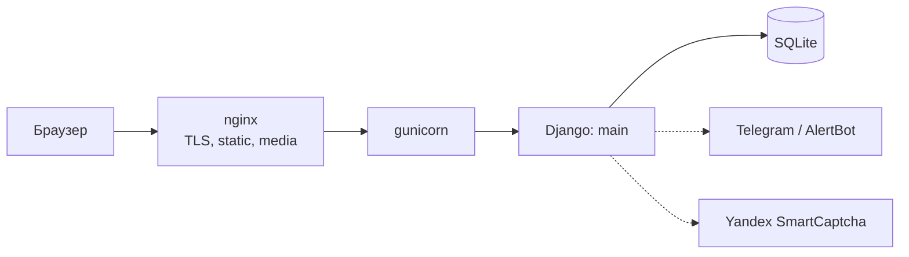

# deev.space

**Русский** · [English](README.en.md)

[](https://github.com/EDeev/deev.space/actions/workflows/ci.yml)
[](https://github.com/EDeev/deev.space/actions/workflows/docker.yml)
[](https://github.com/EDeev/deev.space/releases)
[](LICENSE)

Персональный сайт-портфолио Python-разработчика: проекты, блог, опыт и стек, оценки статей без
регистрации. Исходный код сайта [deev.space](https://deev.space).

**Статус:** личный проект, активно развивается · работает на [deev.space](https://deev.space)


**Стек:** Python 3.12 · Django 4.2 · SQLite · bleach · Yandex SmartCaptcha · gunicorn + nginx · Docker

## Возможности

- Главная с карточкой-паспортом, стеком по категориям и блоком «В цифрах»
- Блог: категории, галереи, вложения, ссылки с автоматическим превью, комментарии с ответами
- Лайки и дизлайки без регистрации — по подписанной cookie, с лимитом оценок с одного IP
- Уникальные просмотры статей с фильтром ботов
- Проекты, достижения, опыт и образование — весь контент редактируется в админке
- Форма обратной связи с капчей и уведомлением владельцу в Telegram
- `sitemap.xml`, человекопонятные адреса, свои страницы 404 и 500

## Быстрый старт

```bash
git clone https://github.com/EDeev/deev.space.git && cd deev.space
cp .env.example .env      # задайте DJANGO_SECRET_KEY
docker compose up -d
docker compose exec web python manage.py createsuperuser
```

Сайт откроется на `http://localhost:8000`, админка — на `/admin/`. Готовый образ:
`docker pull ghcr.io/edeev/deev.space` или `docker pull dcr.deev.su/edeev/deev.space`.

## Установка без Docker

```bash
python -m venv .venv && source .venv/bin/activate
pip install -r requirements.txt
cp .env.example .env      # для разработки: DJANGO_DEBUG=True
python manage.py migrate
python manage.py populate_demo     # демо-контент, по желанию
python manage.py createsuperuser
python manage.py runserver
```

## Конфигурация

Все настройки — переменные окружения (полный список — [`.env.example`](.env.example)):

| Переменная | Назначение |
|---|---|
| `DJANGO_SECRET_KEY` | секретный ключ Django, обязателен при `DJANGO_DEBUG=False` |
| `DJANGO_DEBUG` | режим отладки, по умолчанию `False` |
| `DJANGO_ALLOWED_HOSTS`, `DJANGO_CSRF_TRUSTED_ORIGINS` | домены сайта через запятую |
| `DJANGO_DB_PATH`, `DJANGO_MEDIA_ROOT` | где лежат база SQLite и загруженные файлы |
| `SMARTCAPTCHA_CLIENT_KEY`, `SMARTCAPTCHA_SERVER_KEY` | Yandex SmartCaptcha для формы обратной связи |
| `EMAIL_*`, `CONTACT_EMAIL` | отправка писем с формы обратной связи |
| `ALERTBOT_TOKEN`, `ALERTBOT_CHAT_ID` | уведомление владельцу в Telegram о новом сообщении |
| `SOCIAL_AUTOPOST`, `TELEGRAM_*`, `VK_*` | автопостинг новых статей, по умолчанию выключен |

> [!IMPORTANT]
> С `DJANGO_DEBUG=False` сайт включает HSTS и редирект на HTTPS. Для запуска без TLS (локально или за
> прокси, который сам терминирует HTTPS) задайте `DJANGO_SECURE_SSL_REDIRECT=False`.

## Как выглядит

| О себе | Проекты |
|---|---|
|  |  |
| **Блог** | **Мобильная версия** |
|  |  |

## Как устроено



Одно приложение `main`: модели контента, оценок и настроек сайта, классовые представления, JSON-API
для оценок и комментариев, middleware анонимного посетителя. Подробности:

- [docs/architecture.md](docs/architecture.md) — модели, оценки без регистрации, антинакрутка, безопасность
- [docs/deploy.md](docs/deploy.md) — запуск в Docker и как устроен боевой сервер

## Развёртывание

[deev.space](https://deev.space) работает на VPS: gunicorn под отдельным пользователем за nginx с
сертификатом Let's Encrypt, статика и загрузки отдаются nginx. Доступность и срок сертификата
отслеживает Prometheus. Docker-образ собирает GitHub Actions на каждый тег `v*` и публикует в GitHub
Packages и в реестр `dcr.deev.su`.

## Разработка

```bash
pip install -r requirements-dev.txt
ruff check . && pytest
```

Тесты (pytest-django) запускаются в боевом режиме: голосование и антинакрутка, формы, экранирование,
страницы и статика. CI выполняет то же самое на каждый push и pull request.

## Лицензия

MIT — см. [LICENSE](LICENSE).

## Автор

**Деев Егор Викторович** — [GitHub](https://github.com/EDeev) · [Telegram](https://t.me/DeevEgor) · [egor@deev.space](mailto:egor@deev.space)

---

<div align="center">
  <sub>⭐ Если проект оказался полезным, поставьте звёздочку на GitHub!</sub>
  <p><sub>Сделано с ❤️ — <a href="https://deev.space">deev.space</a></sub></p>
</div>
